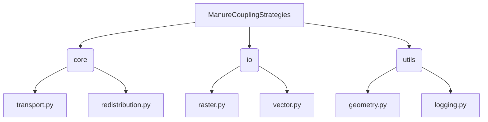

# Manure Coupling Strategies 算法包

## 目录结构与功能说明（中英文）

---

## 1. `core/` 核心算法 Core Algorithms

- **transport.py**  
  粪便运输空间分配算法（如线性规划、距离约束等）。  
  Implements manure transport spatial allocation algorithms (e.g., linear programming, distance constraints).
  - `optimal_allocation_linprog`：主分配函数，输入余缺栅格和最大运输距离，输出分配后余缺栅格。
    - Main allocation function, input: supply-demand raster and max transport distance, output: allocated raster.
  - 其他辅助函数如`direct_list`、`move_array`等。
    - Other helpers: `direct_list`, `move_array`, etc.

- **redistribution.py**  
  畜禽再分配优化算法（如按行政区、畜种、线性规划等）。  
  Implements livestock redistribution optimization (by region, species, linear programming, etc.).
  - `update_inPs`：全局/分区再分配主函数。
    - Main function for global/region-wise redistribution.
---

## 2. `io/` 数据读写与预处理 Data I/O & Preprocessing

- **raster.py**  
  栅格数据的读取、写入、掩膜等操作。  
  Raster data reading, writing, masking, etc.
- **vector.py**  
  矢量数据（如行政区shp）的读取、处理。  
  Vector data (e.g., administrative boundaries) reading and processing.

---

## 3. `utils/` 工具函数 Utilities

- **geometry.py**  
  空间分析、掩膜生成等。  
  Spatial analysis, mask generation, etc.
- **logging.py**  
  日志、进度条等通用工具。  
  Logging, progress bar, and other general utilities.

---

如需详细函数参数与用法，请参考各模块内的文档字符串和注释。
For detailed function parameters and usage, please refer to the docstrings and comments in each module.
